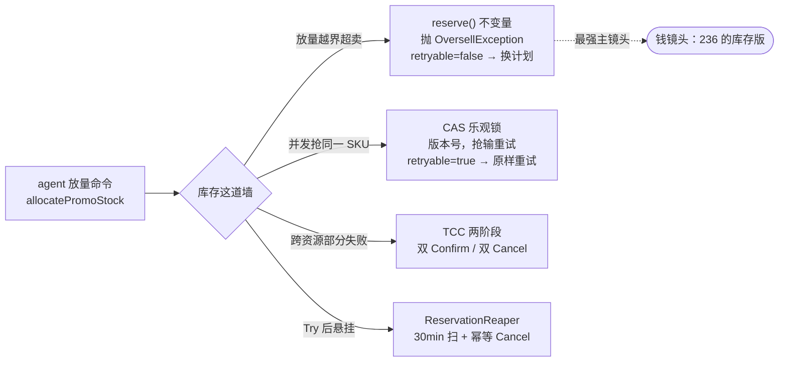
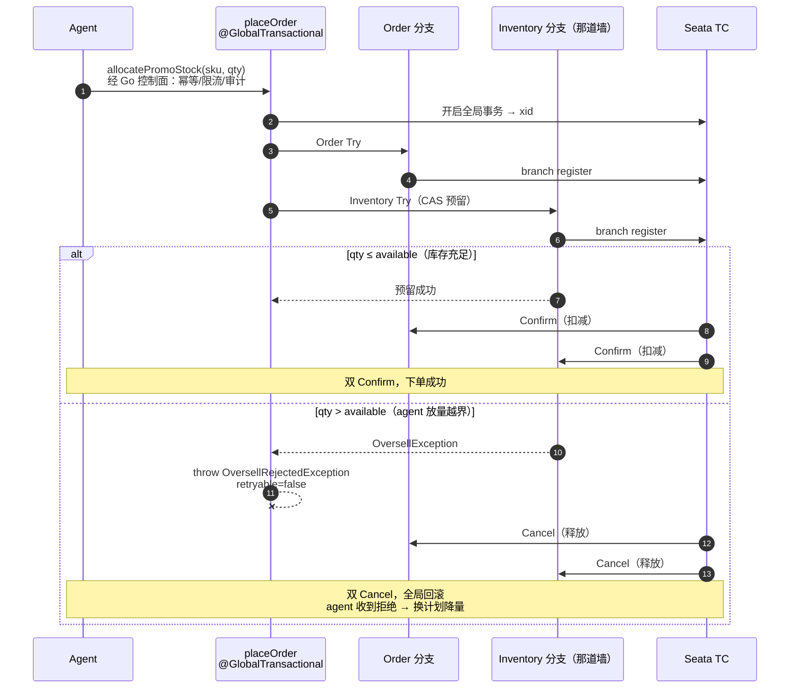

# 放量下单时，库存这道墙：哪些能交给 AI agent、哪些必须领域兜底

> 当 AI agent 想给爆款 SKU "放点量"时，它一把要了 999 件 —— 库存只有 100，领域说：不行，会卖穿。
>
> 但这次的"不行"要比上一篇更硬：它得在几百个人同时抢同一个 SKU、在一笔同时动 order 和 inventory 的分布式事务里，**依然站得住** 。

> 全部代码开源：**https://github.com/wheningo/orderDemo** （欢迎 star / issue）
> 本篇是 Phase 2，承接上一篇《别让 AI agent 当你系统的超级管理员》—— 上一篇的墙是单聚合的内存不变量，这一篇墙没变，**战场变了** 。

**仓库结构**

| 模块 | 语言 / 栈 | 职责 |
|---|---|---|
| `agent/` | Python · LangGraph | 决策大脑：observe → decide → dispatch → verify |
| `gateway/` | Go | 控制面：幂等键 / 限流 / 审计 / MCP |
| `business/hotrank-service/` | Java 21 · Spring Boot 3.5 | 领域层：聚合 + 不变量 + TCC 分支 |
| `business/contracts/` | Java | 共享命令 / `CommandResult` 契约 |
| 协调者 | Seata TC | 全局事务：双 Try → 双 Confirm / 双 Cancel |


---

## 1. 问题：Phase 1 的墙，放到「并发 + 分布式」里还立得住吗？

上一篇里，agent 发了 `weight=236`（合法范围 1–100），领域的 compact constructor 一句话顶回去。那道墙好守 —— **单线程、单资源、纯内存** ，一个 `if` 就是真理。

Phase 2 换了场景：agent 要给促销 SKU 放量分配库存。两件事变了：

- **并发** —— 放量抢购，几百个请求在同一瞬间扣同一个 SKU。
- **分布式** —— 下单要同时动 `order` 和 `inventory` 两个资源，成了一笔跨资源事务。

同一道"不超卖"的墙，现在要扛的不是一种失败，是 **四种** 。一个 `if` 不够了。

## 2. 边界：哪些交给 agent，哪些必须领域兜底

这是全篇的总纲，也是标题的答案：

- **可以交给 agent 的** —— 选哪个 SKU 放量、放多少。这是策略，是概率性的，**它会过激、会 overshoot** （一把要 999）。这正是 agent 的价值：它敢决策。
- **必须由领域兜底、agent 碰不得的** —— 永不超卖（不变量）、预留的原子性（要么都成、要么都不成）、超时悬挂的回收。这些是 **正确性** ，不容一次概率失误。

一句话：**agent 提议，领域裁决** 。Phase 1 那道墙，在分布式下的延伸就是这条边界。

## 3. 核心：一道墙，四件事，四件武器

同一道"不超卖"的墙，面对四种不同的失败，用四件不同的武器。这张图是全篇的方法论浓缩：



- **放量越界超卖 → 不变量** ：`reserve()` 在内存里判 `qty > available` 就抛 `OversellException`。这是 Phase 1 那道墙的直系后代。
- **并发抢同一 SKU → CAS 乐观锁** ：版本号 `WHERE version = ?`，抢输的（affected=0）重试，绝不让两个请求都以为自己拿到了库存。
- **跨资源部分失败 → TCC 两阶段** ：order 与 inventory 各一个分支，Seata 保证要么一起 Confirm、要么一起 Cancel，不会出现"订单建了、库存没扣"。
- **Try 后悬挂 → reaper 兜底** ：万一 Confirm/Cancel 都没来（TC 也失联），定时任务扫出停在 Tried 的预留、幂等 Cancel，把卡住的库存还回去。

注意这四件武器 **拒绝的东西不同、给 agent 的信号也不同** —— 这是下一节代码里最关键的一处设计。

## 4. 代码：墙长什么样

### 4.1 不变量：墙的内核（对照 Phase 1 的 compact constructor）

```java
public void reserve(int qty) {
    if (qty <= 0) throw new IllegalArgumentException("qty must be positive");
    if (qty > available()) {
        throw new OversellException(sku, qty, available());   // 越界，当场拒绝
    }
    this.reserved += qty;
}
```

`Inventory` 是领域对象，`reserve` 是它唯一的预留入口。**你没法绕过它把 `reserved` 改大** —— 跟 Phase 1"拿不到一个非法的命令实例"一个思路。

### 4.2 CAS：抗并发

预留落库走乐观锁，版本号不匹配就是抢输了：

```java
@Update("UPDATE inventory SET reserved = #{reserved}, total = #{total}, " +
        "version = version + 1 WHERE sku = #{sku} AND version = #{version}")
int updateWithCas(InventoryDO inventoryDO);   // 返回 0 = 版本被人改过 = 抢输
```

重试逻辑 **写在事务外面** ，每一轮都重新读、重新算 —— 这是关键，在 `@Transactional` 里循环重试是读不到别人新提交的版本的：

```java
public CommandResult tryReserve(String sku, int qty) {
    for (int attempt = 1; attempt <= MAX_CAS_RETRIES; attempt++) {
        CommandResult result = txTemplate.execute(status -> doReserveInTx(sku, qty));
        if (result != null && !result.retryable()) {
            return result;            // 永久结果（成功 / 超卖），立即返回，不重试
        }
        // retryable=true：CAS 抢输，下一轮 fresh read 再来
    }
    return CommandResult.conflictRetryable();
}
```

### 4.3 两种异常 = 两种"不行"（本篇最想讲的一处）

`doReserveInTx` 里两个 catch，对应两种完全不同的失败：

```java
try {
    inventory.reserve(qty);          // 越界 → OversellException
    repository.save(inventory);      // 版本冲突 → OptimisticLockConflictException
    return CommandResult.ok();
} catch (OversellException e) {
    return CommandResult.oversellRejected(sku, qty, (int) e.available());  // retryable=false
} catch (OptimisticLockConflictException e) {
    return CommandResult.conflictRetryable();                              // retryable=true
}
```

`CommandResult` 把这层语义带回给 agent：

```java
public record CommandResult(boolean accepted, String reason, boolean retryable) {
    public static CommandResult oversellRejected(...) { /* retryable = false */ }  // 永久拒绝
    public static CommandResult conflictRetryable()   { /* retryable = true  */ }  // 瞬时冲突
}
```

**这是 Phase 1"受控失败"在分布式下的进化** ：上一篇 agent 撞墙只有一种"不行"（越界，退让重试）；这一篇有两种 ——

- `retryable=false`（超卖越界）：**永久拒绝，agent 必须换计划**（降量），原样重发多少次都没用。
- `retryable=true`（CAS 冲突）：**瞬时冲突，原样重试即可**，库存其实还在，只是刚好撞上别人。

agent 要能区分这两种"不行"，否则要么把永久拒绝当瞬时冲突死循环重发，要么把瞬时冲突当永久失败错误放弃。

### 4.4 跨资源：Seata TCC + 抛异常触发回滚

下单是一笔全局事务，order 和 inventory 各是一个 TCC 分支：

```java
@LocalTCC
public interface InventoryTccAction {
    @TwoPhaseBusinessAction(name = "inventoryTccAction",
                            commitMethod = "confirm", rollbackMethod = "cancel")
    boolean tryReserve(BusinessActionContext ctx,
                       @BusinessActionContextParameter(paramName = "sku") String sku,
                       @BusinessActionContextParameter(paramName = "qty") int qty);
    boolean confirm(BusinessActionContext ctx);
    boolean cancel(BusinessActionContext ctx);
}
```

编排层有一个 **极易踩错** 的点 —— 库存不足时必须 **抛异常** ，不能 `return failed`：

```java
@GlobalTransactional(name = "place-order", rollbackFor = Exception.class)
public PlaceOrderResult placeOrder(String productName, int quantity, String sku) {
    boolean inventoryOk = inventoryTccAction.tryReserve(null, sku, quantity);
    if (!inventoryOk) {
        // 抛，不是 return —— 只有抛异常才会触发 Seata 全局回滚 → 双 Cancel
        throw new OversellRejectedException("...sku=" + sku + ", qty=" + quantity);
    }
    return PlaceOrderResult.success(null, RootContext.getXID());
}
```

`return failed` 的话，全局事务会照常 commit，已经 Try 成功的 order 分支被 Confirm，库存却没扣 —— 数据就裂了。**这一个 `throw` 是整条分布式链路正确性的开关。**

## 5. 钱镜头

### 镜头 ①：50 个线程抢 100 库存，永不超卖（不需要 TC，现在就能跑）

并发测试灌入 `total=100` 的 SKU，开 50 个线程、每个抢 10，**总需求 500 抢 100** ：

```java
@SpringBootTest
@Sql(statements = {"DELETE FROM inventory",
    "INSERT INTO inventory (sku, total, reserved, version) VALUES ('SKU-RACE', 100, 0, 0)"})
class InventoryConcurrencyTest {
    @Test
    void concurrentReservesNeverOversell() throws Exception {
        int threadCount = 50, qtyPerThread = 10;   // 50 × 10 = 500，库存只有 100
        // ... 50 个线程在 startGate 同时放开，并发抢 reserve("SKU-RACE", 10)

        int totalReserved = successCount.get() * qtyPerThread;
        assertTrue(totalReserved <= 100, "Oversell detected!");   // 核心断言：永不超卖
    }
}
```

不管 50 个线程怎么抢，成功数 × 10 永远 ≤ 100。**"绝不超卖"被实测钉死，不是嘴上说说。**

### 镜头 ②：agent 放量 999，被当场拒绝（不需要 TC，现在就能跑）

agent 一把要 999，库存 100：

```bash
curl -XPOST localhost:8080/inventory/reserve \
  -H 'Content-Type: application/json' \
  -d '{"sku":"SKU-RACE","qty":999}'
```

返回（`retryable=false`，这是"永久拒绝"，agent 收到就该换计划，而不是原样重发）：

```json
{
  "accepted": false,
  "reason": "Oversell rejected: sku=SKU-RACE, requested=999, available=100",
  "retryable": false
}
```

这就是 Phase 1 的 `weight=236` 在库存域的版本 —— 一次概率系统的过激决策，被领域当场顶回，并带回一个让 agent 能正确反应的信号。

### 镜头 ③：分布式下单，超卖触发全局回滚（需要 TC）

> ⚠️ 这一镜头需要 Seata TC 在线（见下方复现）。HTTP 响应形状如下；完整的 `xid / branch register / 双 Cancel` 日志 trace 待 TC 跑通后补。

正常下单（双 Confirm）：

```bash
curl -XPOST localhost:8080/orders/place \
  -d '{"productName":"Coffee","quantity":3,"sku":"SKU-RACE"}'
# → 200  {"success": true, "xid": "192.168.x.x:8091:xxxxxxxx"}
```

放量超卖（throw → 全局回滚 → 双 Cancel）：

```bash
curl -XPOST localhost:8080/orders/place \
  -d '{"productName":"Coffee","quantity":999,"sku":"SKU-RACE"}'
# → 409  {"title":"Oversell Rejected", "status":409, "retryable": false}
```

这条链路的时序，两条路一图说清：



> 兜底：万一某个分支的 Confirm/Cancel 始终没到（TC 也失联），`ReservationReaper` 每分钟扫一次，把停在 Tried 超过 30 分钟的预留幂等 Cancel 掉 —— 卡住的库存不会永远悬着。

## 6. 放弃了什么

每个选择都有代价，写出来才是工程，不是堆术语。

- **乐观锁，不用悲观锁 / `select for update`** ：放量是读多写争，悲观锁把热点 SKU 串行化，吞吐塌。乐观锁让无冲突的请求并行，只惩罚真正撞上的那几个。**代价** ：高冲突下重试会放大，极端热点要配合分段库存（留到后续）。这个代价我认。
- **TCC，不用纯 AT** ：AT 模式靠全局行锁 + undo_log，促销热点库存不想被那把全局锁卡住；TCC 业务自定义两阶段，预留/扣减/释放都是普通行级操作。**代价** ：要自己写 Try/Confirm/Cancel 三段，还得处理幂等、空回滚、悬挂。代码量大，我认。
- **为什么把"两种不行"显式分开** ：本可以都返回一个 `false` 省事。但 agent 是概率系统，它需要知道"这条路彻底堵死（换计划）"还是"挤一下再来（重试）"。少这一个 bool，agent 要么死循环、要么误放弃。**这是有意识的设计，不是过度工程。**

## 7. 要点

| 失败模型 | 谁挡 | 怎么挡 | agent 怎么反应 |
|---|---|---|---|
| 放量越界超卖 | 领域 · 不变量 | `reserve()` 抛 `OversellException` | `retryable=false`，换计划降量 |
| 并发抢同一 SKU | 领域 · CAS | 版本号乐观锁，抢输重试 | `retryable=true`，原样重试 |
| 跨资源部分失败 | Seata TCC | Try / Confirm / Cancel 两阶段 | 全局回滚，双 Cancel |
| Try 后悬挂 | reaper | 定时扫 + 幂等 Cancel | 无感，后台兜底 |

四行不是冗余，它们挡的失败、给 agent 的信号都不同。墙不是一个 `if`，是一组各司其职的防线。

## 8. 复现

```bash
git clone https://github.com/wheningo/orderDemo.git
cd orderDemo

# 1. Seata TC —— 官网/Docker Hub 走 GFW，用阿里云 Apache 镜像
wget https://mirrors.aliyun.com/apache/incubator/seata/2.1.0/apache-seata-2.1.0-incubating-bin.tar.gz
tar -xzf apache-seata-2.1.0-incubating-bin.tar.gz
cd apache-seata-2.1.0-incubating/bin && ./seata-server.sh -p 8091 -m file

# 2. 业务服务（需要真 MySQL；纯 TCC 必须关掉 AT 数据源代理）
#    application.yml 已设 seata.enable-auto-data-source-proxy: false
cd business/hotrank-service
mvn spring-boot:run \
  -Dspring-boot.run.arguments="--spring.kafka.producer.properties.max.block.ms=1000"

# 3. 镜头①②（不需要 TC）：并发测试 + 放量被拒
mvn -Dtest=InventoryConcurrencyTest test
curl -XPOST localhost:8080/inventory/reserve -d '{"sku":"SKU-RACE","qty":999}'

# 4. 镜头③（需要 TC）：分布式下单，正常 + 超卖
curl -XPOST localhost:8080/orders/place -d '{"productName":"Coffee","quantity":3,"sku":"SKU-RACE"}'
curl -XPOST localhost:8080/orders/place -d '{"productName":"Coffee","quantity":999,"sku":"SKU-RACE"}'

# 5. 盯日志确认 Seata 真的接管了
grep -E "xid=|branch|confirm|cancel" logs/order-demo.log
```

> 纯 TCC 别忘了 `seata.enable-auto-data-source-proxy: false` —— 否则 Try 里的本地 SQL 会被当 AT 分支去找 `undo_log` 表，报错。

---

**下一篇预告**：《分布式事务 + Agent 调度：延迟队列怎么变成调度器》—— 当 agent 说"5 分钟后关单"，Seata + RocketMQ 延迟消息怎么接。（复合分区键 / 弹性伸缩这条线再往后放。）